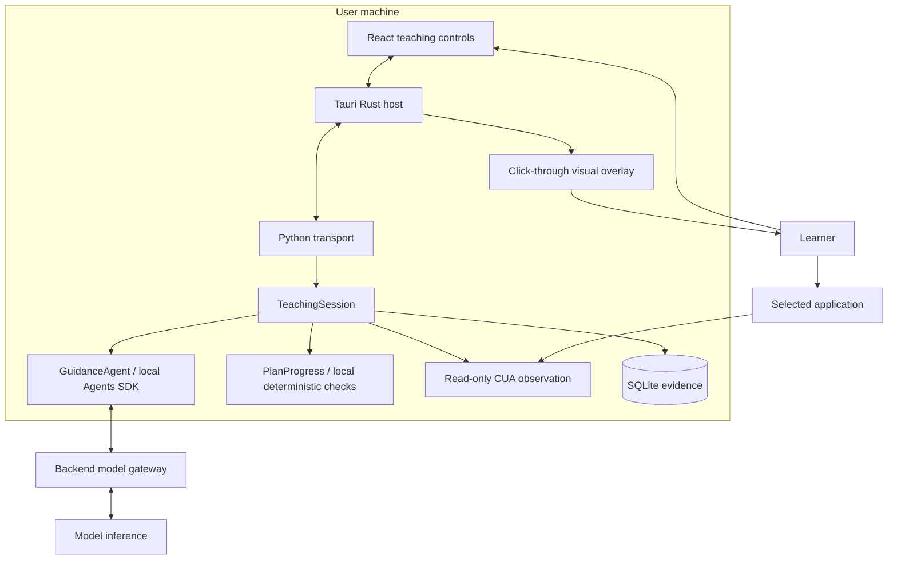

# Tro code architecture

This directory explains the implementation. [The master specification](../rebuild-architecture.md)
remains authoritative for requirements, product decisions and P0–P9 acceptance.
The learner performs every external-app action (F10).

## Read in this order

1. [System and ownership](system.md): processes, modules, data flow and trust boundaries.
2. [Teaching loop](teaching-loop.md): planning, local checks, uncertainty and responsiveness.
3. [Visual targeting](visual-targeting.md): screenshot coordinates and accessibility fallback.
4. [Contracts and lifecycle](contracts-and-lifecycle.md): routing, cancellation and state delivery.
5. [Development and acceptance](development.md): extending the system, tests and limitations.

## Overview

The agent loop runs locally. Model inference is remote. Guidance is visual: no
real pointer motion, input injection, app launch or focus control is exposed.
