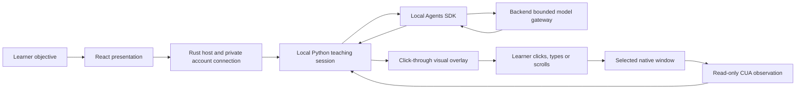

# Reliable native lesson

This milestone supports F10 and the P1/P2 acceptance gates in the [master spec](../rebuild-architecture.md). Tro observes and draws guidance; the learner performs every action. Installed macOS and Windows acceptance remains pending.

## Data and ownership



Python retains the current plan and completed index while preparing a replacement. It hides the cue and pauses first. A failed model call leaves that progress intact; only a valid replacement resets the automatic replan allowance. Cancellation propagates to the worker lifecycle. Automatic recovery keeps its existing one-attempt limit.

React receives a revisioned projection, never provider credentials or screenshot bytes. Observation readiness reflects the worker's last successful read; it is not a promise that both screenshot and accessibility data were complete. Native consent preflight is advisory and belongs to the host process. Unknown Windows consent is represented as null rather than true. Actual installed worker attribution still needs manual proof.

Model readiness is unconfigured, ready after a successful plan, or unavailable after failure. A generic upstream authorization failure cannot distinguish expiry from exhausted budget, so the UI suggests reconnecting without claiming a specific cause. A connection alone does not prove inference works.

## Proof account administration

The operator supplies the existing isolated proof database through DATABASE_URL and the approved root HTTPS endpoint. No endpoint is deployed by these commands.

```sh
TRO_API_MODE=proof cargo run --locked -p tro-api -- migrate
TRO_API_MODE=proof cargo run --locked -p tro-api -- proof-issue --origin https://APPROVED_HOST --output NEW_PRIVATE_FILE
TRO_API_MODE=proof cargo run --locked -p tro-api -- proof-revoke --account ACCOUNT_UUID
```

Issuing creates a one-hour session and writes its credential once to a new private file. Only the SHA-256 digest enters PostgreSQL. Existing files are refused. Unix mode is 0600; Windows restricts the empty file ACL before writing. Install the file privately at the host's documented proof-account location. Never paste it into React or commit it. Revocation invalidates grants through the existing session join.

Filesystem writes and database commits cannot share a transaction. Failed issuance removes its output and attempts compensating revocation after an ambiguous commit. If the database is unavailable, the operator must confirm revocation before reusing that identity; expiry remains bounded.

## Manual lesson and evidence

Open tests/fixtures/native/gestures.html yourself. Reset, increase the counter once, type hello, then scroll the practice area to its actual end. Run three consecutive trials on each platform. The separate canvas circle exercises visual grounding with learner confirmation; drag remains a separate manual probe.

Version 2 of tests/acceptance/native-proof-evidence.schema.json requires an explicit pass, fail or not_run and a reason for every check. Historical records remain readable but cannot satisfy new acceptance. Validate a local record with:

```sh
node scripts/rebuild/native-evidence.mjs .local/native-proof/RUN.json
```

Record the exact commit, installer digest, signing state, platform and tester. Collect at least 20 local transition durations and 10 Stop-to-hidden durations using one monotonic clock per sample. Both p95 targets are 1000 ms. Keep model latency separate. Runtime observation/model/grounding timings are bounded to the latest 200 samples, contain no screen content, and measure phase duration only; they do not prove end-to-end overlay latency. Manual evidence must measure that independently.

The validator checks completeness and thresholds, not whether a person truly performed the trial. Synthetic tests and CI builds cannot establish installed permission attribution, real model quality, untouched pointer/focus, native targeting or mixed-DPI correctness. Keep these checks not_run until measured. Existing secondary-display restrictions remain in place.
