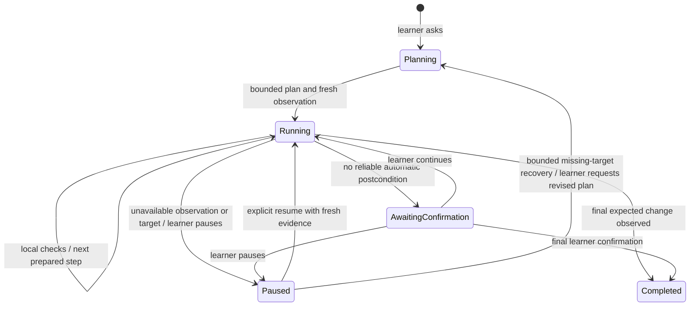

# Planned guidance and local progress

This implements the first bounded P2 planning/progression slice, using P1's native
foundation. It does not establish full P1 platform acceptance or complete P2.

## Plan once, guide locally

`runtime.ask` observes the selected window and calls the local Agents SDK to
prepare one to three steps. Each step contains a semantic target (exact role and
label), caption, visual gesture, optional drag destination/scroll direction, and
an optional expected accessibility value. The first target must uniquely exist
in the planning observation. Future targets may appear after earlier steps.
Plans do not contain executable native actions or cached screen coordinates.

The controller takes a fresh observation before presenting. Every later cue is
resolved again against the selected window. Duplicate or missing semantic targets
never become guessed coordinates.

## Progress evidence

The host performs sequential read-only refreshes, waiting 250 ms between completed
requests. There is no overlapping polling or model call per frame/step. This is
bounded polling, not an OS change-event subscription. Actual cadence includes
native observation latency. Refresh uses accessibility data without screenshots.

Automatic advancement requires a previously observed nonmatching expected value
for the current step, followed by two distinct, complete, fresh matching observations
of the same window. A result already present when a step starts cannot silently
skip that step. Repeated, stale, partial, or ambiguous observations cannot confirm.
Each tick advances at most one step.

When automatic checking is uncertain, the learner sees Continue. That produces a
learner-reported step fact, separate from an observed state change. Neither proves
mastery or who caused the change. The manual checker remains available for isolated
cue testing and does not define the planned journey's progression.

Missing controls clear guidance; after ten seconds from step activation, an unresolved
target triggers bounded recovery, then pauses if recovery is unavailable. Observation failure pauses immediately. An unmatched value
alone does not mean failure: the learner may simply be working. Pause stops observation;
resume reestablishes a baseline. Stop cancels work and clears the in-memory plan.

## Model use and scope

A missing target persisting for ten seconds permits one automatic replan per learner
request, using the objective and fresh screen. If recovery fails or the replacement
plan also loses its target, guidance pauses. Permission/observation failures do not
trigger model calls. Learners can explicitly request another plan at any time.
There is no unbounded retry loop or automatic call after each successful step.
The existing grant budget and model timeout apply to planning and replanning.
Completed short plans can be followed by another request. Longer lesson horizons,
material-aware planning, visual model checks for ambiguous outcomes, durable resume,
and richer adaptive replanning remain future work.
