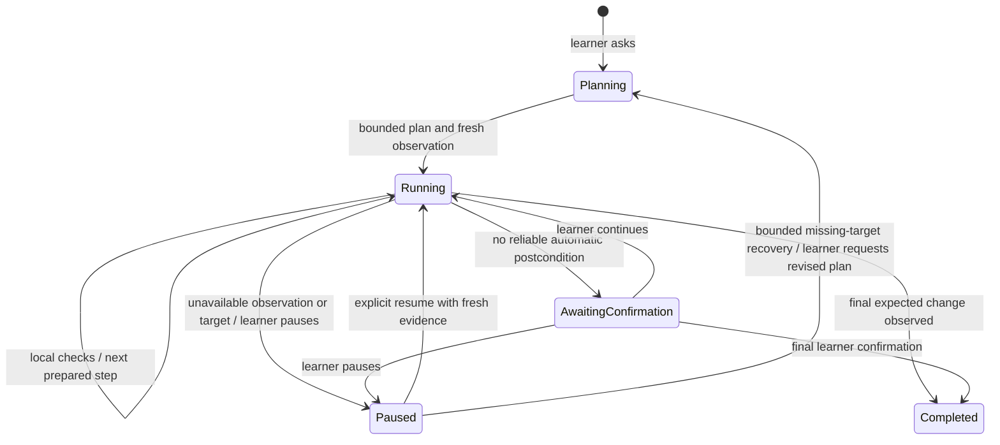

# Planned guidance and local progress

The learner experience follows a Playcode-style interaction principle: show the
next idea immediately, explain it in ordinary language and keep the learner in
control. Tro's cursor is an instructor rendered as pixels, not an input device.
While the desktop app is running, a small Tro companion icon follows beside the
learner's physical pointer to make Tro's presence obvious. The demonstration cursor
can move away from that companion to the target, circle it or show a ghost trajectory;
neither overlay cursor intercepts or produces input. Presentation stays minimal: one
small fixed-radius orbit establishes the target, then only the requested click, drag,
type or scroll cue moves. Large target rectangles never enlarge the orbit.

This implements the first bounded P2 planning/progression slice, using P1's native
foundation. It does not establish full P1 platform acceptance or complete P2.

## Plan once, guide locally

`runtime.ask` observes the selected window and calls the local Agents SDK. The
agent stages exactly one immediately useful step through the fixed Instructor Cursor
function-tool list and stops on that first tool result. This keeps initial planning
to one model round-trip; later guidance starts from fresh screen context. Each step contains an accessibility selector or normalized
screenshot region, caption, visual gesture, optional drag destination/scroll direction, and
an optional expected accessibility value. The first target must uniquely exist
in the planning observation. Future targets may appear after earlier steps.
Plans never contain executable native actions. Visual regions are bound to their
planning screenshot; see [visual targeting](visual-targeting.md) for freshness rules.
The model receives only non-empty role/label pairs that are unique in the current
accessibility snapshot; duplicate and blank entries are omitted. It must use the
screenshot path when no listed selector fits, and one Instructor Cursor tool call is
required for a successful response.

Debug builds log only the model exchange's structure: bounded byte/item counts,
image presence, offered/selected cursor tool names, argument field names, target
kind, timing and safe validation category. They never log instruction text,
transcripts, screenshots, accessibility labels/values, arguments, reasoning,
provider bodies, grants or credentials.

F11 is an input method for the same teaching plan. Chord-down pins and observes
one frontmost window while Rust captures rolling completed audio files. Release
freezes the final transcript once, then starts one bounded guidance-planning run.
Partial transcripts never enter the agent. Typed fallback skips transcription but
uses the identical plan, overlay, pacing and cancellation path. No cursor tool can
dispatch native input, and interrupted guidance is never replayed.

The controller takes a fresh observation before presenting. Every later cue is
resolved again against the selected window. Duplicate or missing semantic targets
never become guessed coordinates.

Voice/text status treats native presentation as an explicit boundary: Planning may
have a journey without a visible cue, while Guiding begins only after Rust accepts
and shows a fresh grounded overlay. Silent rejection, expiry or unsupported display
geometry becomes a visible failure instead of a false Guiding state.

```mermaid
stateDiagram-v2
  [*] --> Planning: learner asks
  Planning --> Running: bounded plan and fresh observation
  Running --> Running: local checks / next prepared step
  Running --> AwaitingConfirmation: no reliable automatic postcondition
  AwaitingConfirmation --> Running: learner continues
  Running --> Paused: unavailable observation or target / learner pauses
  AwaitingConfirmation --> Paused: learner pauses
  Paused --> Running: explicit resume with fresh evidence
  Paused --> Planning: bounded missing-target recovery / learner requests revised plan
  Running --> Completed: final expected change observed
  AwaitingConfirmation --> Completed: final learner confirmation
```

## Progress evidence

The host performs sequential read-only refreshes, waiting 250 ms between completed
requests. There is no overlapping polling or model call per frame/step. This is
bounded polling, not an OS change-event subscription. Actual cadence includes
native observation latency. Accessibility-only plans refresh without screenshots;
plans with remaining visual targets also capture images to detect stale locations.

Automatic advancement requires a previously observed nonmatching expected value
for the current step, followed by two distinct, complete, fresh matching observations
of the same window. A result already present when a step starts cannot silently
skip that step. Repeated, stale, partial, or ambiguous observations cannot confirm.
Each tick advances at most one step.

When automatic checking is uncertain, the learner sees Continue. That produces a
learner-reported step fact, separate from an observed state change. Neither proves
mastery or who caused the change. The manual checker remains available for isolated
cue testing and does not define the planned journey's progression.

Missing controls clear guidance; after ten seconds from step activation, an unresolved
target triggers bounded recovery, then pauses if recovery is unavailable. Observation failure pauses immediately. An unmatched value
alone does not mean failure: the learner may simply be working. Pause stops observation;
resume reestablishes a baseline. Stop cancels work and clears the in-memory plan.

## Model use and scope

A changed visual frame or a missing semantic target persisting for ten seconds
permits one automatic replan per learner
request, using the objective and fresh screen. If recovery fails or the replacement
plan also loses its target, guidance pauses. Permission/observation failures do not
trigger model calls. Learners can explicitly request another plan at any time.
There is no unbounded retry loop or automatic call after each successful step.
The existing grant budget and model timeout apply to planning and replanning.
Completed short plans can be followed by another request. Longer lesson horizons,
material-aware planning, visual model checks for ambiguous outcomes, durable resume,
and richer adaptive replanning remain future work.
