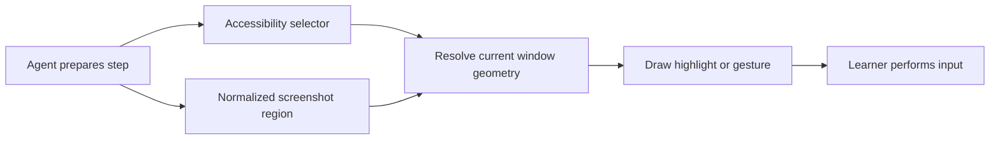

# Accessibility and screenshot targeting

A planned step can locate its target in two ways. Tauri capability files restrict
UI-to-host commands; they do not enumerate teachable controls or restrict the
planner to particular applications. Both targeting paths use the same overlay.

| Target                 | Location source                                                              | Suitable for                                     |
| ---------------------- | ---------------------------------------------------------------------------- | ------------------------------------------------ |
| Accessibility selector | Unique role and label resolved to current native bounds                      | Standard buttons, fields and labelled controls   |
| Visual region          | Model-proposed rectangle normalized to the entire selected-window screenshot | Canvas shapes, custom controls and unlabelled UI |



## Coordinate mapping

The visual target contains a description and x, y, width and height between zero
and one. The rectangle must fit wholly inside the screenshot. A point is represented
by a small rectangle. It is not a desktop coordinate. In F10 and F11 it terminates
at presentation: the host maps it only to overlay geometry after revalidating the
pinned PID, window ID, bounds and screenshot geometry.

For window bounds `(left, top, width, height)`, the mapping is:

```
source.x = left + target.x * width
source.y = top + target.y * height
source.width = target.width * width
source.height = target.height * height
```

This handles resized screenshots and negative desktop origins. The existing host
mapping converts native desktop coordinates into overlay CSS coordinates for the
monitor. Drag source and destination can independently use either targeting path.
The capture adapter checks screenshot validity and aspect ratio against window
bounds. Actual mixed-DPI/platform calibration remains an installed acceptance gate.

## Screenshot identity and freshness

PlanProgress binds visual proposals to the planning image fingerprint and window
bounds. While visual steps remain, refresh captures include screenshots. Identical
image bytes and unchanged bounds permit local reuse, with a new observation ID and
expiry. Any image/bounds change clears the old location and permits the existing
one automatic replan per learner request. Missing capture pauses without model
retries. Repeated recovery failure requires explicit learner action.

This is conservative exact-image comparison, not visual tracking. Animations,
text caret changes, compression variation or other harmless pixel changes can
invalidate a cue. It avoids reusing old coordinates after scrolling or navigation,
but dynamic screens may need frequent explicit replanning until a stronger visual
tracker is implemented. No real-model accuracy or desktop acceptance is claimed.

Python marks screenshot-derived cues as `grounding=visual`, with a screenshot ID.
The public observation carries only that ID, not image bytes. Rust verifies the
cue belongs to the current observation and selected window, and that its rectangles
are contained in the window. Visual regions are never inserted into the observed
accessibility tree or represented as evidence that a native control exists.

## Observation versus progress

Screenshot capture can be used when accessibility observation fails or is incomplete.
A bounded screen-only retry stays inside the same native read timeout. Screen capture
still requires OS permission. Partial AX data never confirms progress automatically.

Visual location alone does not prove completion. An available, complete accessibility
postcondition can still drive automatic advancement. Otherwise the learner uses
Continue, recorded separately as a learner report. Model-based visual outcome checks
are future work. In every guided teaching and voice/text journey the learner
performs every click, drag, scroll and keystroke. Overlay animations are ghost
demonstrations and never dispatch operating-system input.
